# TextBin

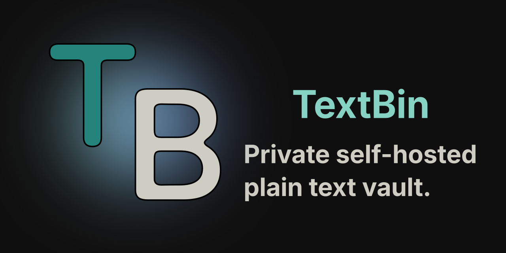

TextBin is a small private text vault for people who just want to write and store plain text without turning it into a second operating system.

No Markdown-first workflow.  
No uploads.  
No search index.  
No public feed.  
No "workspace magic".  

Just login, create a note, write text, save it as a real `.txt` file, and move on with your life.

It is built with Vue 3, TypeScript, Tailwind CSS, Fastify, and SQLite. Note contents are stored as real `.txt` files on disk. SQLite is used only for application data such as users, sessions, login attempts, instance settings, and share records.

## Screenshots

### Login page
<details>
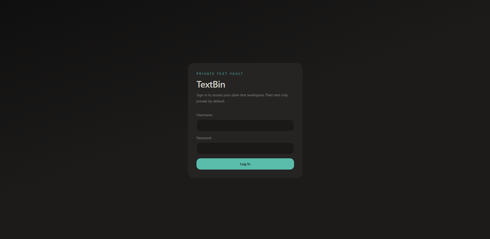
</details>

### Dashboard
<details>
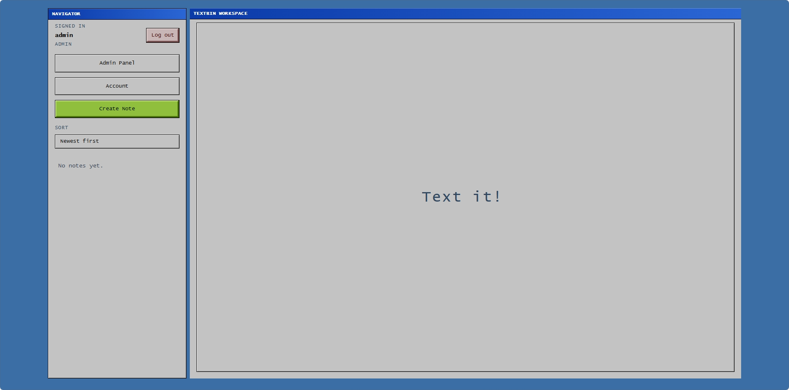
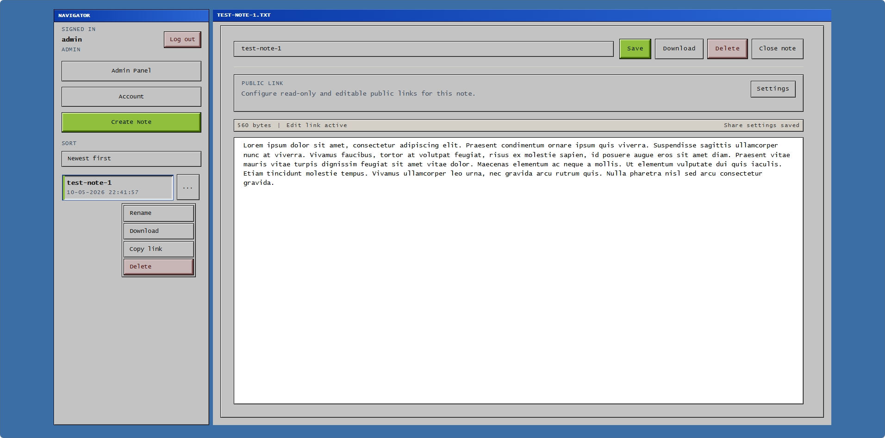
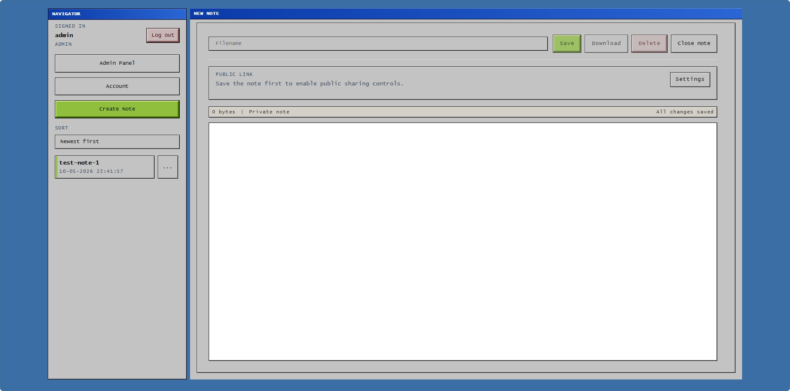
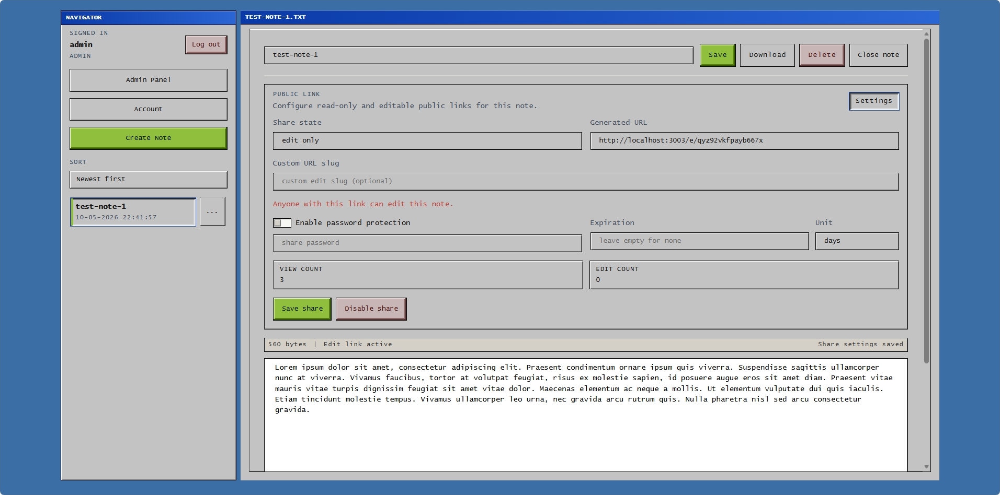
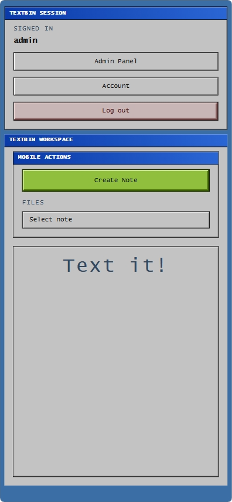
</details>

### Account panel
<details>
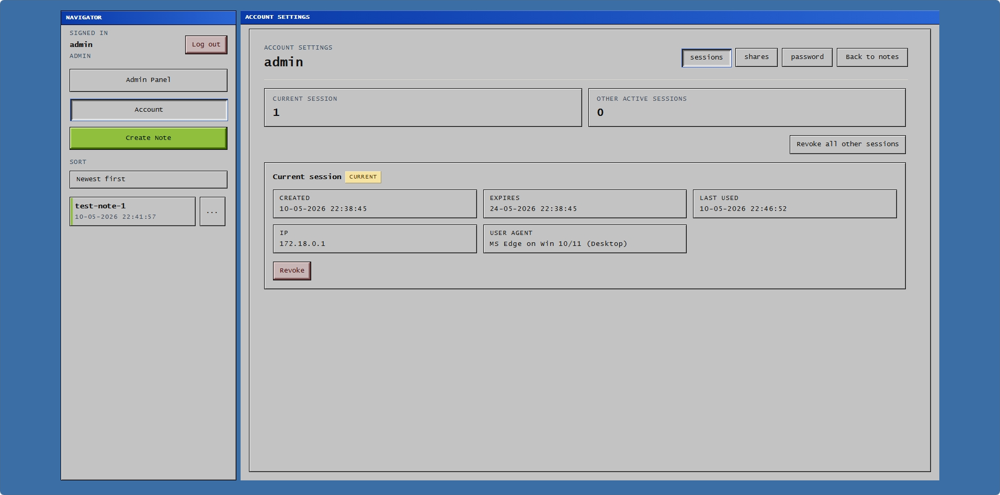
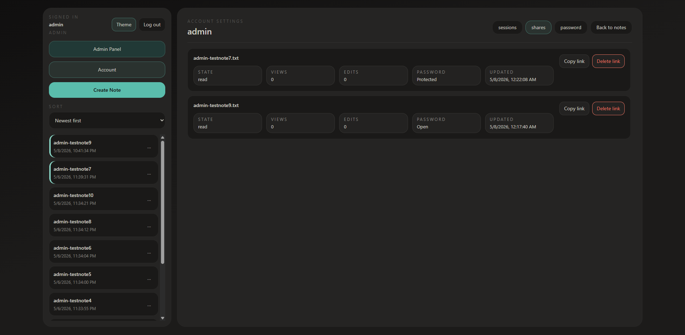
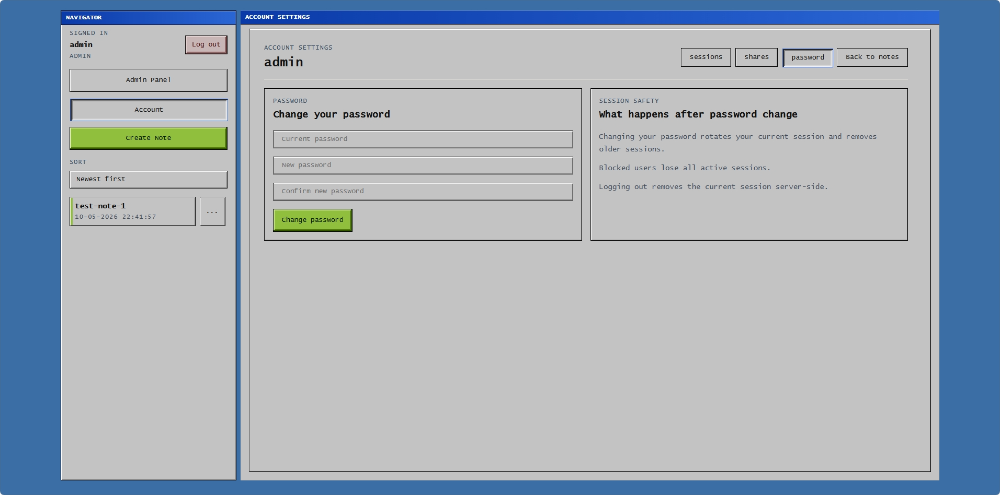
</details>

### Admin panel
<details>
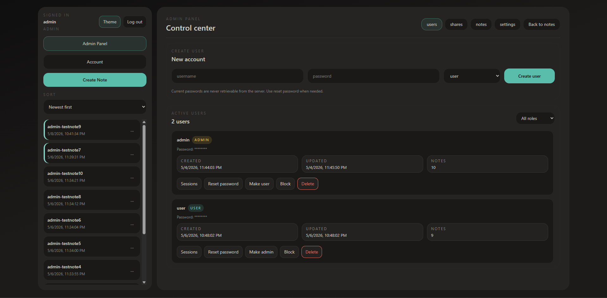
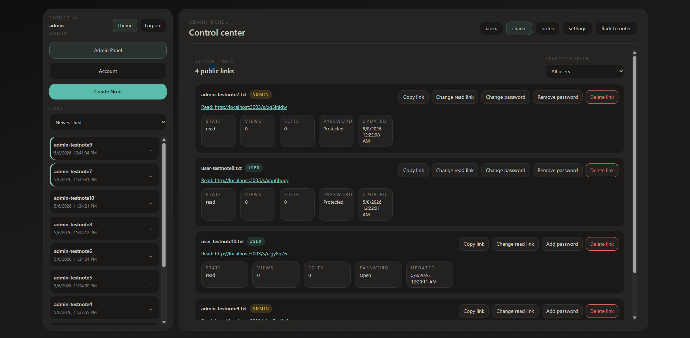
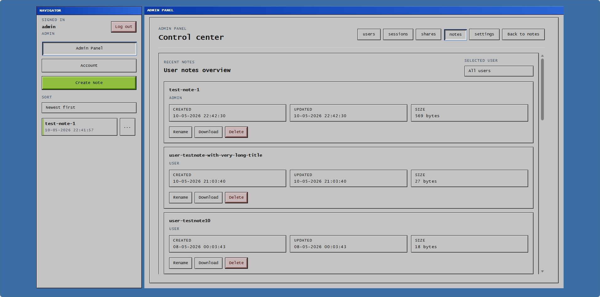
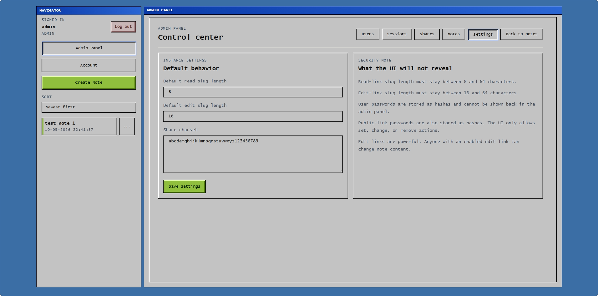
</details>

### Public links
<details>
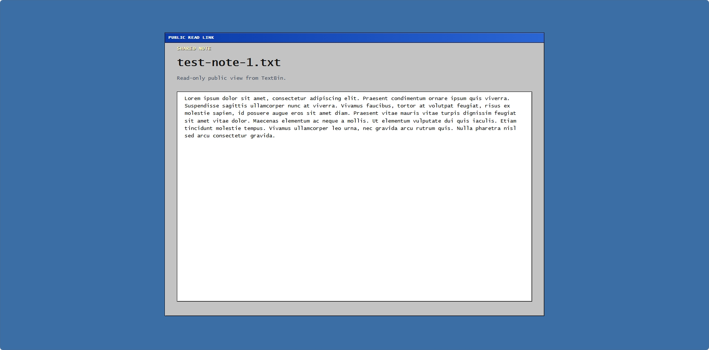
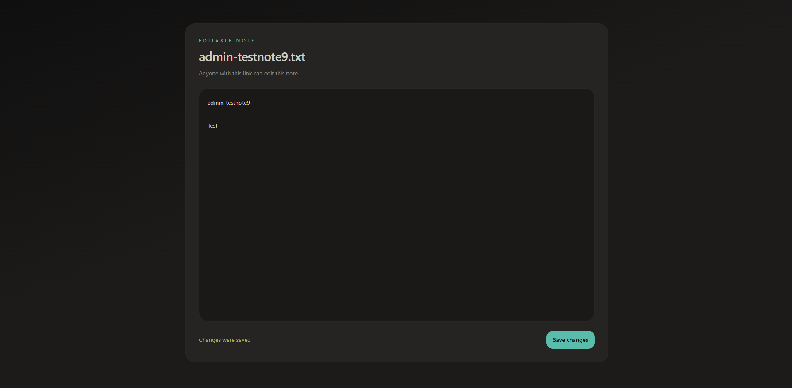
</details>


## Demo

There is no public demo.

If you want to try it, you have to run it. 🙂

## What It Does

- Private login-only text workspace
- Plain text notes stored as real files
- Per-user note directories
- Admin panel for users, shares, notes, and instance settings
- Account settings for sessions, password changes, and personal shares
- Optional public read-only and editable links
- Optional passwords and expiration for public links
- Mobile and desktop UI
- Single-container Docker deployment

## Why This Exists

TextBin exists because sometimes you do not need a full knowledge management system. Sometimes you just need a clean place for notes, snippets, drafts, configs, lesson ideas, commands, or random thoughts that should not live in a messenger chat called "Saved Messages".

The main idea is simple:

- your actual notes are `.txt` files
- the app is only a web interface around them
- SQLite does not own your content
- backups are boring, which is good

If the app disappears tomorrow, your notes are still readable as normal text files.

## Features

- Username and password authentication
- `HttpOnly` cookie sessions
- First-start admin bootstrap from environment variables
- `admin` and `user` roles
- Notes stored under `NOTES_DIR/<username>`
- Sorting by newest, oldest, name A-Z, and name Z-A
- Create, edit, rename, download, and delete notes
- Login rate limiting by username and IP
- Account settings for session management, password change, and personal shares
- Optional public links for notes
- Optional password protection for public links
- Optional expiration for public links
- Separate read-only and editable public links under `/s/:slug` and `/e/:slug`
- View counts for public links
- Edit counts for editable public links
- Revision backups before public edit overwrites
- Admin-only user management
- Admin session review and revoke tools
- Admin-only instance settings
- Dark, light, and system theme support

## Storage Model

Expected host structure:

```text
./data/app.sqlite
./data/notes/admin/example.txt
./data/notes/alice/meeting-notes.txt
```

The application uses:

- `DB_FILENAME=/data/app.sqlite`
- `NOTES_DIR=/data/notes`

Actual note content is not stored in SQLite.

SQLite is used for app state. The note files are just note files. Very advanced technology.

## Environment Variables

| Name | Required | Default | Purpose |
| --- | --- | --- | --- |
| `NODE_ENV` | No | `development` | Enables production behavior |
| `PORT` | No | `3000` | Fastify listen port |
| `APP_URL` | No | `http://localhost:3000` | Public base URL |
| `APP_SECRET` | Yes | `change_me_long_random_secret` | Session token HMAC secret |
| `ADMIN_USERNAME` | Yes | `admin` | First-start admin username |
| `ADMIN_PASSWORD` | Yes | `change_me` | First-start admin password |
| `RESET_ADMIN_ON_START` | No | `false` | Reset the first admin user from env on next boot |
| `DB_FILENAME` | No | `./data/app.sqlite` | SQLite database file |
| `NOTES_DIR` | No | `./data/notes` | Directory for note files |
| `MAX_NOTE_SIZE` | No | `262144` | Maximum note size in bytes |
| `LOGIN_MAX_FAILED_ATTEMPTS` | No | `5` | Failed login attempts allowed in the time window |
| `LOGIN_ATTEMPT_WINDOW_MINUTES` | No | `10` | Window for failed login counting |
| `LOGIN_BLOCK_MINUTES` | No | `15` | Temporary block duration |
| `SESSION_DAYS` | No | `14` | Session lifetime in days |
| `COOKIE_SECURE` | No | `false` | Set to `true` behind HTTPS |
| `COOKIE_DOMAIN` | No | unset | Cookie domain, usually your site hostname |
| `TRUST_PROXY` | No | `true` | Trust proxy headers such as `X-Forwarded-Proto` |

## Quick Start With Docker

1. Create a project directory and prepare the data folder:

```bash
sudo mkdir -p data/notes
sudo chown -R 100:101 data
sudo chmod -R 700 data
```

> [!CAUTION]
> If you run into permission issues, make the folder writable for the user running the container. Avoid ```chmod -R 777``` unless you are testing locally and know exactly why you are doing it.


2. Create a `docker-compose.yml` file.

```yaml
services:
  textbin:
    image: bonsaiborn/textbin:v7
    container_name: textbin
    ports:
      - "127.0.0.1:3001:3000"
    environment:
      NODE_ENV: "production"
      APP_URL: "https://example.com"
      APP_SECRET: "replace_with_a_long_random_secret"
      ADMIN_USERNAME: "admin"
      ADMIN_PASSWORD: "replace_with_a_strong_password"
      RESET_ADMIN_ON_START: "false"
      DB_FILENAME: "/data/app.sqlite"
      NOTES_DIR: "/data/notes"
      MAX_NOTE_SIZE: "262144"
      LOGIN_MAX_FAILED_ATTEMPTS: "5"
      LOGIN_ATTEMPT_WINDOW_MINUTES: "10"
      LOGIN_BLOCK_MINUTES: "15"
      SESSION_DAYS: "14"
      COOKIE_SECURE: "true"
      COOKIE_DOMAIN: "example.com"
      TRUST_PROXY: "true"
      PORT: "3000"
    volumes:
      - ./data:/data
    restart: unless-stopped
```

3. Change at least these values:

- `APP_URL`
- `APP_SECRET`
- `ADMIN_PASSWORD`
- `COOKIE_SECURE`
- `COOKIE_DOMAIN` if you deploy on a real domain

For a local test, ```COOKIE_SECURE``` can stay ```false```.

For local development, leave `COOKIE_DOMAIN` unset.

For HTTPS deployment, set it to ```true```.

4. Start the app:

```bash
docker compose up -d
```

5. Open the app in your browser.

For a VPS deployment, a typical setup is:

- DNS points to the VPS
- nginx or Caddy handles HTTPS
- TextBin is bound to `127.0.0.1:<port>`
- the reverse proxy forwards traffic to the container

Example port binding:
```yaml
ports:
  - "127.0.0.1:3001:3000"
```
This keeps the app away from direct public access. Let the reverse proxy do its job.

## Docker Image Workflow

If you prefer building locally and pushing an image to a registry:

```bash
docker build -t yourname/textbin:v1 .
docker push yourname/textbin:v1
```

Then on your VPS:

```bash
docker pull yourname/textbin:v1
docker compose up -d
```

You do not need to run ```npm run build``` before ```docker build```. The Dockerfile builds the frontend and backend inside the image.

## Local Development

Install dependencies:

```bash
npm install
```

Start frontend and backend development servers:

```bash
docker compose up --build
```

The frontend runs through Vite and proxies ```/api/*``` to the backend.

## Security Notes

TextBin is intentionally small, but it still tries to avoid the obvious footguns.

- All note APIs require authentication
- `/data` and `/data/notes` are never served statically
- Notes are isolated per user under ```NOTES_DIR/<username>```
- Filenames are sanitized and forced to ```.txt```
- Absolute paths, slashes, backslashes, and ``..`` are rejected
- Final file paths are resolved and checked to stay inside ```NOTES_DIR```
- Note content is treated strictly as plain text
- Request body size is capped
- Note size is capped through ```MAX_NOTE_SIZE```
- Sessions are stored server-side and delivered through ```HttpOnly``` cookies
- Session lifetime is configurable through `SESSION_DAYS`
- Logout deletes the current session server-side
- Password changes revoke older sessions
- Blocked users lose active sessions
- Admins can review and revoke user sessions
- The container runs as a non-root user
- Public share links support separate read-only and editable modes
- Password-protected public share attempts are rate-limited
- Password-protected public edit access attempts are rate-limited
- Password-protected share previews do not reveal the note title in page metadata
- Public edit saves create revision backups before overwriting note content
- Mutating authenticated API requests are guarded by `Origin`, `Sec-Fetch-Site`, and CSRF checks
- Suspicious direct paths such as `/data/*`, `/notes/*`, `*.sqlite`, and `*.db` are blocked with `404`
- `robots.txt`, meta `noindex`, and `X-Robots-Tag` are used to discourage indexing

## Known Limitations

- TextBin is designed for a single instance, not a horizontally scaled cluster.
- Editable public links are intentionally powerful and should be treated like secrets.
- This is a serious self-hosted project, but it is still a small app, not a formally audited security product.

## What TextBin Is Not

TextBin is not trying to replace:

- Obsidian
- Notion
- SilverBullet
- HedgeDoc
- Google Docs
- your entire personality

It is just a small self-hosted text box with login, files, and a few useful buttons.

## Honest Project Status

Yes, this project was created with some hardcore vibecoding involved, and Codex helped a lot along the way.

That said, TextBin is used for real personal needs, not just as a pretty GitHub ornament. It will keep evolving over time, probably in the usual self-hosted rhythm: sudden bursts of energy followed by suspiciously quiet weeks.

## Tech Stack

- Frontend: Vue 3 + TypeScript + Tailwind CSS
- Backend: Fastify
- Database: SQLite
- Password hashing: Argon2id via `@node-rs/argon2`
- Deployment: Docker / Docker Compose

## License

MIT License
